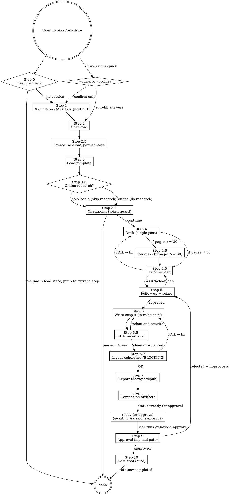

# Relazione (Report Writer)

Versione corrente: vedi `VERSION` — note di rilascio in `CHANGELOG.md`.

## Overview

Skill modulare per generare relazioni formali in Italiano/Inglese a partire dai file della cwd. Architettura a strati:

- `SKILL.md` — orchestratore (questo file)
- `steps/` — istruzioni dettagliate per ogni step (caricati on-demand via Read)
- `templates.md` — strutture per ogni tipologia
- `scripts/` — automazioni eseguibili (self-check, redact, mining, export, ecc.)
- `presets/` — risposte preconfigurate per pattern ricorrenti
- `pdf-templates/` — YAML pandoc/Eisvogel preset
- `schemas/session-state.schema.json` — schema validazione state
- `VERSION` — semver corrente skill

**Core principle:** la relazione DEVE leggersi come scritta dall'utente. Mai riferimenti a Claude, Anthropic, AI, "generato da intelligenza artificiale", disclaimers, o `Co-Authored-By: Claude`. Il testo è dell'utente. Assoluto. Vedi `steps/forbidden-terms.md` per la lista completa.

## When to Use

- Comandi: `/relazione`, `/relazione-quick`, `/relazione-continua`, `/relazione-rollback`, `/relazione-stats`, `/relazione-diff`, `/relazione-doctor`, `/relazione-setup`
- Richieste in linguaggio naturale: "scrivimi una relazione", "fammi la relazione su…", "prepara un report di…", "write a report about…"
- Documentare progetto, esperienza, tesi, ricerca, lab, stage, codebase, bug, incidente

**NON usare per:** summary informali, chat replies, commit message, PR description, README (a meno che l'utente non chieda esplicitamente "relazione in formato README").

## Tool registry

| Categoria | Tool | Path | Quando usarlo |
|---|---|---|---|
| **Quality check** | `self-check.sh` | `scripts/quality/self-check.sh` | Step 4.5 e 6 — orchestratore |
| | `forbidden-check.sh` | `scripts/quality/forbidden-check.sh` | grep AI tells + auto-ref |
| | `readability.py` | `scripts/quality/readability.py` | Gulpease/Flesch per sezione |
| | `tone-drift.py` | `scripts/quality/tone-drift.py` | drift di registro |
| | `citation-density.py` | `scripts/quality/citation-density.py` | densità citazioni |
| | `voice-lock.py` | `scripts/quality/voice-lock.py` | lock voice profile per consistency |
| **Privacy** | `pii-redact.py` | `scripts/security/pii-redact.py` | Step 6.5 — email/IP/path/CF |
| | `secret-scan.sh` | `scripts/security/secret-scan.sh` | Step 6.5 — token/key/password |
| **Content intel** | `git-history-miner.sh` | `scripts/intel/git-history-miner.sh` | cronologia attività da git |
| | `zotero-import.py` | `scripts/intel/zotero-import.py` | bib da Zotero/Mendeley |
| | `schema-to-diagram.py` | `scripts/intel/schema-to-diagram.py` | ER diagram da Prisma/SQL |
| | `glossary-extract.py` | `scripts/intel/glossary-extract.py` | glossario auto da codice |
| **Output extra** | `executive-summary.py` | `scripts/export/executive-summary.py` | Step 8 — 1-pagina sintesi |
| | `slide-deck.py` | `scripts/export/slide-deck.py` | Step 8 — Marp/Beamer |
| | `bundle.sh` | `scripts/export/bundle.sh` | Step 8 — zip finale |
| | `defense-pack.py` | `scripts/export/defense-pack.py` | Step 8 — solo tesi |
| **Knowledge** | `knowledge-graph.py` | `scripts/intel/knowledge-graph.py` | Step 2.6 — build KG / from-scan / query |
| **Layout** | `layout-coherence.py` | `scripts/quality/layout-coherence.py` | Step 6.7 — verifica ordinamento blocchi (BLOCCANTE) |
| **Approval** | `audit-trail.py` | `scripts/workflow/audit-trail.py` | Step 9 — append-only audit log |
| | `watermark-pdf.py` | `scripts/export/watermark-pdf.py` | Step 9 — togli/aggiungi DRAFT/IN-REVIEW |

## Flow



## Step 0 — Auto-resume check (SEMPRE all'avvio)

Prima di qualsiasi domanda, cerca tutte le cartelle `relazioni*/` e relativi state:

```
Glob: relazioni*/.session/session-state.json
Glob: relazioni*/                                  # cartelle anche senza .session/
```

Classifica i risultati:
- **In-progress** — state esiste con `"status": "in-progress"`
- **Completed** — state esiste con `"status": "completed"`
- **Orphan** — cartella `relazioni*/` senza `.session/session-state.json` (es. backup manuale, sessione interrotta senza state)

### Decisione

| Situazione | Comportamento |
|---|---|
| 0 cartelle | Procedi con Step 1 (nuova sessione) |
| 1 cartella in-progress | Mostra riepilogo + `AskUserQuestion` (Riprendi / Nuova / Abbandona) |
| ≥ 2 cartelle (di qualsiasi stato) | **Menu di selezione** (sotto) |
| 1 cartella completed, 0 in-progress | Segnala esistenza, `AskUserQuestion` (Nuova / Apri esistente) |

### Menu di selezione (≥ 2 cartelle)

Usa **UNA sola `AskUserQuestion`** con le cartelle ordinate per `last_updated_at` desc (più recenti prima). Ogni opzione include:

- Icona di stato: `[IN CORSO]` / `[OK]` / `[?]` per orphan
- Nome cartella
- Tipologia (se presente in state)
- Step corrente (se presente)
- Ultima modifica (formato `YYYY-MM-DD HH:MM`)
- Titolo cover (se presente, troncato a 40 char)

Esempio opzioni:
```
[IN CORSO] relazioni/              — tecnica · step-4-ready · 2026-04-15 · "Virtual Retail..."
[IN CORSO] relazioni-2026-04-10/   — tesi · step-6-refining · 2026-04-12 · "Tesi magistrale..."
[OK]       relazioni-2026-03-28/   — stage · completed · 2026-03-29 · "Relazione di stage"
[?]        relazioni-BACKUP-xxx/   — (nessuno state, orphan)
--- Azioni ---
Avvia nuova sessione (ignora esistenti)
Abbandona una sessione (rinomina BACKUP-<ts>)
```

Se più di 4 cartelle, usa "Other" per le meno recenti.

### Dopo la selezione

1. **Se sessione in-progress / ready-for-approval scelta**: **valida** state contro `schemas/session-state.schema.json` (manca `skill_version`/`current_step` → state vecchio, vedi `steps/backup-and-versioning.md`). Carica `answers`, mostra **menu di ripresa guidato** (sotto), poi salta domande risposte e jump a `current_step` salvato.
2. **Se sessione approved/completed scelta**: `AskUserQuestion` (Apri in lettura / Duplica in nuova cartella / Modifica in loco — crea nuova versione `1.x`). Mai sovrascrivere file approved.
3. **Se orphan scelta**: avvisa "nessuno state trovato" e chiedi (Ricostruisci state dai file / Rinomina in BACKUP e nuova / Ignora).
4. **Se "Nuova sessione"**: procedi Step 1 (le esistenti restano intatte).
5. **Se "Abbandona"**: secondo `AskUserQuestion` per scegliere quale, rinomina con `BACKUP-<ISO>`, poi torna al menu.

### Menu di ripresa guidato (`/relazione-continua` o sessione esistente scelta)

Subito dopo aver caricato lo state, mostra **UNA `AskUserQuestion`** con queste opzioni (in quest'ordine):

1. **Riprendi da dove eravamo** *(default — più frequente)* — salta a `current_step` salvato e prosegui il flow
2. **Apri il file e decidiamo insieme cosa modificare** *(opzione libera)* — Read del file di output principale (`RELAZIONE.md` o `.tex`), Read di `.session/scan-summary.md`, poi prompt aperto: «Ho riletto la relazione. Dimmi liberamente cosa vuoi cambiare (sezioni da riscrivere, dati da aggiornare, tono, lunghezza, ecc.) e procediamo.» — l'orchestratore aspetta input libero, NON una scelta strutturata
3. **Mostra dashboard sessione** — riepilogo `relazione-stats` per la sessione (file scritti, mock residui, self-check, layout-check, status)
4. **Cambia una risposta del Step 1** — ri-apri una delle 9 domande iniziali e ri-genera dalle parti dipendenti
5. **Salta a uno step specifico** *(avanzato)* — `AskUserQuestion` con elenco step dispari (4-draft, 5-followup, 7-export, ecc.)

L'opzione 2 è **specificamente progettata per lavoro guidato** in cui l'utente non sa ancora quali modifiche vuole — la skill legge il file, si prepara, e poi l'utente parla a ruota libera. Non chiedere altre domande prima di aver fatto Read del file.

**Slash commands correlati:** `/relazione-continua` (resume esplicito — stessa logica menu), `/relazione-rollback` (ripristino backup), `/relazione-stats` (dashboard), `/relazione-approve` (Step 9 finalizzazione).

## Quick mode (entry path alternativo)

Se invocato come `/relazione-quick` o con `--profile=<nome>`:

1. Carica preset da `presets/<nome>.yaml` se presente
2. Auto-detect tipologia da nome cartella (vedi `~/.claude/commands/relazione-quick.md` per mapping)
3. Compila `answers` con default
4. Mostra le scelte all'utente con un solo `AskUserQuestion` di conferma:
   - `Conferma e procedi` → vai direttamente a Step 2
   - `Modifica` → mostra le 9 domande standard
5. Resto identico

Vedi `steps/profiles.md` per schema preset e auto-detect.

## Step 1 — Initial Questions

**USA SEMPRE `AskUserQuestion`**, mai testo libero. 10 domande in 4 batch:

**Batch 1 (4 domande):**
1. Tipologia — `progetto`, `tecnica`, `tesi`, `stage` (altre 8 via "Other": laboratorio, codice, analisi-codice, bug, finale, ricerca, esperienza, custom)
2. Lingua — `italiano`, `inglese`
3. Stile — `formale accademico`, `semi-formale aziendale`, `tecnico divulgativo`, `narrativo personale`
4. Destinatario — `docente / commissione`, `azienda / committente`, `team interno`, `pubblico generico`

**Batch 2 (4 domande):**
5. Lunghezza — `corta (5-15 pp)`, `media (15-40)`, `lunga (40-80)`, `molto lunga (80+)` (Other per numero esatto)
6. Elementi visivi (multiSelect) — `tabelle`, `schemi/diagrammi`, `grafici di dati`, `nessuno`
7. Formato — `md`, `latex`, `both` (suggerisci default in base a tipologia, vedi Quick Reference)
8. Mock data — `no-placeholder`, `sì-mock`

**Batch 3 (1 domanda):**
9. Ricerca online — `online (raccomandato per tesi/ricerca/progetto/analisi-codice)`, `solo-locale`

**Batch 4 (1 domanda — solo se stima file > 15 o `--scan=deep`):**
10. Modalità scan — `rapido (single-pass, default < 15 file)`, `profondo-parallelo (4 agenti + hybrid store, raccomandato per progetti grandi — vedi steps/step-2-parallel.md)`

Se < 15 file scansionabili, salta la domanda 10 e imposta `scan_mode: "rapido"` automaticamente.

**Pre-flight code detection (eseguito prima di Batch 5):**

Esegui Glob per file sorgente nella cwd con i pattern:
```
**/*.{ts,tsx,js,jsx,mjs,cjs,py,go,rs,dart,java,kt,swift,rb,php,c,cpp,cc,h,hpp,scala,clj,ex,exs,vue,svelte,sql,prisma}
```
Considera "presenza di codice" se Glob ritorna ≥ 5 file (escludendo automaticamente `node_modules`, `.next`, `dist`, `build`, `.git`, `vendor`, `target`, `__pycache__`, `venv`, `.venv`, `coverage`).

Salva il flag `cwd_has_source_code: true|false` in memoria locale. Usalo per attivare Batch 5.

**Batch 5 (1 domanda — solo se `cwd_has_source_code = true`):**
11. Snippet di codice nella relazione — `no (relazione neutra, nessun code block)`, `sì-mirato (4-6 snippet nelle sezioni più rilevanti)`, `sì-estensivo (10+ snippet in tutte le sotto-sezioni rilevanti + firme TS in Appendice B)`, `solo-appendice (firme/snippet concentrati in Appendice B, corpo testo neutro)`

**Default in base a tipologia** (proponi come prima opzione "Recommended"):
- `tecnica`, `codice`, `analisi-codice`, `bug`, `spec-tecnica`, `runbook`, `incident-postmortem` → `sì-estensivo`
- `progetto`, `tesi`, `ricerca`, `stage`, `finale`, `whitepaper`, `case-study`, `handover` → `sì-mirato`
- `esperienza`, `laboratorio`, `status-report` → `solo-appendice`
- `proposta`, `rfp-response`, `sow`, `business-case`, `audit-report`, `compliance-report` → `no`

Se `cwd_has_source_code = false`, salta Batch 5 e imposta `code_snippets: "no"` automaticamente in `answers`. Salva la risposta in `answers.code_snippets`.

**Se `latex` o `both`**, terza chiamata aggiuntiva:
- Classe documento: `article`, `report`, `book`
- Stile bibliografico: `bibtex`, `biblatex+biber`, `nessuna`
- Template: `default`, `ho un template da fornire`

**Se "Other" su tipologia → `custom`**: chiedi struttura desiderata in chat libera.

**Mock rules sintetiche** (dettaglio in `steps/forbidden-terms.md` e Quick Reference):
- `sì-mock`: dati realistici marcati `[MOCK]`, listati in "Nota metodologica" finale
- `no-placeholder`: `[DA COMPLETARE: <cosa>]` ovunque manca info
- **MAI mockare** (anche con sì-mock): nomi di persone reali, bibliografia, DOI/URL, dati fiscali, citazioni dirette, metriche dichiarate misurate

**Online rules sintetiche** (dettaglio in `steps/step-3.5-research.md`):
- `online`: WebSearch/WebFetch attivi per stato dell'arte, algoritmi, librerie, standard, bibliografia
- `solo-locale`: ZERO chiamate web. Citazioni non recuperabili dai file → `[RIFERIMENTO DA VERIFICARE]`

**Salva tutte le risposte in `answers` di session-state.json.**

## Step 2 — Scan the Current Directory

Due modalità in base a `answers.scan_mode`:

### Step 2 `rapido` (default, single-pass nel main orchestrator)

- Usa Glob/Grep/Read (mai `find`/`cat`)
- **Escludi sempre:** `node_modules`, `.git`, `dist`, `build`, `.next`, `out`, `.cache`, `coverage`, `__pycache__`, `venv`, `.venv`, `target`, binary, lock files
- **Includi:** sorgenti, docs (`.md`/`.txt`/`.pdf`), config, `package.json`/`pyproject.toml`/etc., schemi (`.prisma`/`.sql`), README, immagini se domanda 6 lo richiede, `.tex`/`.cls`/`.sty`/`.bib` se latex
- Per codebase grandi: leggi README/package.json prima, poi sample mirato per tipologia
- Cwd vuota o irrilevante → avvisa utente, chiedi materiale

### Step 2 `profondo-parallelo` (4 subagent + hybrid store)

**Vedi `steps/step-2-parallel.md` per workflow completo.**

Highlights:
- 4 subagent paralleli (narrative/entities/temporal/assets) estraggono facet-specific
- Merge conservativo in `entities.jsonl` con provenance preservation
- Build `index/` (by-facet/file/section/date) + `graph.json`
- Round-trip check bloccante via `scripts/workflow/scan-rebuild-check.sh`
- Output: hybrid store in `.session/scan/` invece di raw content in main context
- Guadagno: −50-70% pressione main context, +15-20% precisione fattuale, ~90% meno allucinazioni su date/email. Vedi `docs/SKILL-GUIDE.md` per numeri completi.

**Fallback automatico a `rapido`** se:
- Sotto 15 file scansionabili
- Subagent crash 3x consecutivi
- Round-trip check FAIL dopo 2 tentativi di re-merge

## Step 2.5 — Persistenza state (OBBLIGATORIO)

Crea cartella di output (regole sotto in Step 6) con sottocartella `.session/`:

```
relazioni[-YYYY-MM-DD]/
├── .session/
│   ├── session-state.json       # validato contro schemas/session-state.schema.json
│   ├── scan-summary.md          # tabella file scansionati
│   ├── codebase-notes.md        # stack/moduli/fornitori/schema dati
│   ├── research-notes.md        # output Step 3.5 (o nota "ricerca disabilitata")
│   └── backups/                 # vedi steps/backup-and-versioning.md
├── RELAZIONE.md                 # output (scritto Step 6)
├── RELAZIONE.tex                # se formato include latex
└── references.bib               # se biblatex/bibtex
```

Inizializza `session-state.json` con:
- `status: "in-progress"`
- `skill_version`: leggi da `<skill_dir>/VERSION`
- `created_at`, `last_updated_at`
- `current_step: "step-2.5-persist"`
- `answers: {...}` da Step 1
- `output_folder`, `cover: {}`, `files_written: []`, `deps_installed: {}`
- `backups: []`, `mock_inventory: []`, `voice_profile: null`, `self_check_results: null`
- `token_budget: { estimated_tokens: <stima>, ... }` — vedi `steps/token-budget-guard.md`

**Aggiorna `last_updated_at` e `current_step` dopo OGNI step completato.** Validate prima di save.

### Step 2.6 — Build knowledge graph (SEMPRE, leggero)

Subito dopo Step 2.5, costruisci il knowledge graph vettorizzato — produce `.session/knowledge/` (50–200 KB tipici, hash-projection 128-dim). Vedi `steps/knowledge-graph.md`.

```bash
# Se Step 2 era 'rapido':
python3 scripts/intel/knowledge-graph.py build --root <cwd> --out <output>/.session/knowledge

# Se Step 2 era 'profondo-parallelo' (riusa entities.jsonl + graph.json):
python3 scripts/intel/knowledge-graph.py from-scan --scan <output>/.session/scan --out <output>/.session/knowledge
```

Aggiorna `session-state.json`: `knowledge_graph_ref`, `knowledge_graph_built_at`, `knowledge_graph_nodes`.

**Da Step 4 in poi, mai re-read di file sorgente** se il dato è recuperabile dal KG (`query.py "<text>" K`). Solo quando il KG punta a un file e serve testo verbatim, leggi quel singolo file (cache locale Step). Mai citare contenuto non attestato in `nodes.jsonl` o WebSearch.

## Step 3 — Load Template

Read `templates.md`, sezione corrispondente alla tipologia scelta. Definisce: sezioni obbligatorie, sezioni suggerite, registro, follow-up questions specifiche.

## Step 3.5 — Online Research

**Vedi `steps/step-3.5-research.md` per regole complete.**

Gate: se `answers.ricerca_online == "solo-locale"`, scrivi nota in `research-notes.md` e SALTA. Mai WebSearch/WebFetch in tutta la sessione.

Se `online`: WebSearch + WebFetch per stato arte, algoritmi, librerie, standard, bibliografia. Output strutturato in `research-notes.md` (URL, autori, anno, venue, estratto).

**Regola assoluta:** mai inventare URL/DOI/autori/titoli. Cita solo fonti effettivamente recuperate.

## Step 3.9 — Checkpoint pre-draft (token budget guard)

**Vedi `steps/token-budget-guard.md`.**

Stima token consumo per draft + refinement (formula: `5000 + pages*600 + (online ? min(pages*200, 15000) : 0) + (mock ? pages*100 : 0) + pages*300`).

Salva in `session-state.json.token_budget.estimated_tokens`.

`AskUserQuestion`:
- `Continua ora` (se < 60k) → Step 4
- `Two-pass + checkpoint dopo Pass 1` (raccomandato se >= 60k) → Step 4.6
- `Pausa e /clear` → istruisci utente a fare `/clear` poi `/relazione` (auto-resume)
- `Mostra riassunto analisi` → mostra `scan-summary.md` + `codebase-notes.md`, richiedi

Se `Pausa`: salva state con `current_step: "step-4-ready"`, stampa istruzioni resume, termina.

## Step 4 — Generate Draft

**Pre-step:** crea backup pre-draft in `.session/backups/{ISO}-pre-draft/` (vedi `steps/backup-and-versioning.md`).

Modalità single-pass (default per pages < 30) o two-pass (per pages >= 30, vedi `steps/step-4.6-two-pass-writing.md`).

**Length scaling:**
- Short (5-15): solo essenziali, paragrafi compatti
- Medium (15-40): tutte le sezioni, esempi, tabelle, 1-2 pagine bibliografia
- Long (40-80): sottosezioni, motivazioni dietro ogni scelta, alternative scartate, 3-5 pp bibliografia, appendici
- Very long (80+): narrativa estesa fornitori/tool/librerie, codice riga-per-riga, sezioni dedicate a difficoltà/testing/performance/sicurezza, appendici complete

Heuristic: ~400 parole per pagina A4.

**Mock handling:**
- `sì-mock`: riempi con dati realistici, marca prima occorrenza con `[MOCK]` (md) o `\textcolor{orange}{[MOCK]}` / commento `% MOCK` (tex). Append a `mock_inventory[]` in state.
- `no-placeholder`: `[DA COMPLETARE: <cosa>]` ovunque, mai mockare.

**Code snippet handling (basato su `answers.code_snippets`):**
- `no` → nessun code block nel draft, descrivi i moduli solo a parole
- `sì-mirato` → estrai 4-6 snippet brevi (10-30 righe ciascuno) dai file più rappresentativi della tipologia, inseriscili in fenced code block con language hint, alla fine della sotto-sezione di pertinenza. Privilegia: pure functions testabili, formule matematiche, pattern di sicurezza (CSP, JWT), funzioni di calcolo, indici DB unici parziali, SQL migration significative
- `sì-estensivo` → 10+ snippet distribuiti su tutte le sotto-sezioni rilevanti dell'implementazione (§7.2 in tipologia `progetto`, equivalente in altre), più Appendice "Firme di interfaccia" carica con firme TypeScript/Python/Dart dei moduli chiave. Mantieni gli snippet sotto le 60 righe ciascuno
- `solo-appendice` → corpo testo §implementazione neutro (descrizioni a parole, senza code block), Appendice dedicata carica con firme + 1-2 snippet di riferimento per modulo chiave

Regole comuni a `sì-*` e `solo-appendice`:
- Estrai esclusivamente da file realmente esistenti nella cwd (verifica con Read), MAI inventare codice che non esiste
- Specifica sempre il path di provenienza prima del code block: «L'estratto seguente, dal modulo `<path>`, mostra/illustra ...»
- Riduci il codice estratto eliminando dettagli accessori (commenti verbosi, edge case minori), ma preserva la struttura essenziale e l'attribuzione
- Mai includere secret/API key/IP esposti — applica masking se necessario (gestito poi anche da `scripts/security/secret-scan.sh` in Step 6.5)
- Linguaggio fenced code block: usa il language hint corretto (`typescript`, `python`, `dart`, `sql`, `rust`, `go`, ecc.) per abilitare syntax highlight nel PDF (eisvogel + listings)
- Preferisci snippet che illustrano una decisione (es. perché si è scelto X), un pattern non banale, o una formula citata in §3 stato dell'arte
- Aggiungi gli snippet a `files_written[]` solo se vivono in file separati; altrimenti restano inline nel `RELAZIONE.md`

**Voice profile lock** (per long/very long): dopo prima sezione del draft, esegui:
```bash
python3 scripts/quality/voice-lock.py extract <file> --state <state>
```
Le sezioni successive devono mantenere voice profile (verifica in Step 4.5).

**Non gonfiare per raggiungere target.** Se materiale insufficiente, chiedi all'utente, non inventare.

## Step 4.5 — Self-check pre-output

**Vedi `steps/step-4.5-self-check.md` per dettaglio.**

Esegui:
```bash
bash scripts/quality/self-check.sh <file> --lang=<it|en> --state=<state> --target-pages=<N>
```

Orchestratore che lancia: word count, forbidden terms, AI tells, citation density, image references, citation keys, mock inventory consistency, readability (Gulpease/Flesch), tone-drift, voice-lock verify.

Output: report con `[OK]`/`[WARN]`/`[FAIL]`. Salva in `session-state.json.self_check_results`.

- **FAIL > 0** → blocca write, mostra lista, chiedi rewrite, ri-esegui
- **WARN > 0** → mostra, chiedi conferma "procedo o rivedo?"
- **Clean** → procedi a Step 5 o 6

## Step 5 — Follow-up + Refine

Mostra draft. Chiedi domande tipologia-specifiche (da `templates.md`) in batch di 3-5.

Per target lungo: domande approfondite su esperienze personali, dati, numeri, nomi fornitori/colleghi/prodotti, difficoltà.

Se domanda 6 includeva grafici dati ma non forniti, chiedi dati (CSV/JSON) o paths immagini. Se `sì-mock`, usa mock marcati.

Se latex senza template/bib, chiedi ora.

Quando l'utente fornisce dati reali, sostituisci `[MOCK]` corrispondenti e aggiorna `mock_inventory`.

**Integrazioni potenti** (proponi quando rilevante):
- `git-history-miner.sh` per `stage`/`finale`/`progetto`: estrae cronologia da git
- `zotero-import.py` se trovi `*.bib`/`Zotero.json`/`*.ris` nella cwd
- `schema-to-diagram.py` se trovi `schema.prisma` o SQL DDL → ER diagram
- `glossary-extract.py` per `analisi-codice` o tesi tecnica → glossario auto

Backup pre-refine in `.session/backups/{ISO}-pre-refine-{N}/`.

Loop: Step 5 → Step 4.5 → Step 5 finché clean / utente OK.

## Step 6 — Write Final Output

**Cartella di output (REGOLE FERME):**
1. Default: `relazioni/` in cwd
2. Se esiste: `relazioni-YYYY-MM-DD`
3. Se anche quella: `relazioni-YYYY-MM-DD-2`, `-3`, ...
4. **Verifica con Glob/ls PRIMA di creare** — mai assumere
5. `mkdir -p` poi comunica all'utente nome cartella scelto

**File finali (in base a `formato`):**
- `md`: `RELAZIONE.md` (default naming, vedi Quick Reference per altri)
- `latex`: `RELAZIONE.tex` + `references.bib` (se bib)
- `both`: entrambi

**Regole comuni:**
- Path completo: `<cwd>/relazioni[...]/RELAZIONE.md` — mai direttamente in cwd
- Immagini cwd da includere: copia in `<output>/img/` e aggiorna path
- Cover: titolo, autore (chiedi mai inventare anche con sì-mock), data, destinatario
- TOC se >=15 pagine
- `\listoffigures`/`\listoftables` se latex con figure/tabelle numerate
- **Se mock usati:** sezione "Nota metodologica" prima della bibliografia, lista tutti i `[MOCK]`

## Step 6.5 — PII + Secret check

**Vedi `steps/step-6.5-pii-secret-check.md`.**

Default attivo per: `analisi-codice`, `bug`, `codice` o se utente passa `--public`.

```bash
python3 scripts/security/pii-redact.py <file> --mode=warn
bash scripts/security/secret-scan.sh <file>
```

- Secret trovato → BLOCCANTE. Chiedi rimozione/sostituzione con placeholder. Re-run.
- PII trovato → `AskUserQuestion`: redact tutti / interactive review / accetta come internal.

Per modalità `--public`: applica `--mode=redact` direttamente.

## Step 6.7 — Layout coherence check (BLOCCANTE)

**Vedi `steps/step-6.7-layout-coherence.md`.**

```bash
python3 scripts/quality/layout-coherence.py <output>/RELAZIONE.md \
  --style=<accademico|moderno|brand> \
  --tipologia=<tipologia>
```

Per `formato ∈ {latex, both}` esegui anche su `RELAZIONE.tex`. Devono passare ENTRAMBI.

- **FAIL > 0** → BLOCCA. `AskUserQuestion`: `Riordina automaticamente` / `Correggi manualmente (pausa)` / `Forza export (sconsigliato, blocca approvazione)`.
- **WARN > 0** → mostra, chiedi conferma `procedo / rivedo`.
- **OK** → procedi a Step 7.

Salva risultato in `session-state.json.layout_check`. Se `force_overridden: true`, lo step 9 (approve) viene BLOCCATO.

## Step 7 — Export (DUAL-STYLE, DOCX SEMPRE)

**Vedi `steps/step-7-export.md` per workflow completo.**

### Regola ferma — output minimo garantito

| Output | Quando |
|---|---|
| `RELAZIONE.docx` | **SEMPRE** (no eccezioni) |
| `RELAZIONE.pdf` (Stile B = moderno) | **SEMPRE** |
| `RELAZIONE.tex` + `RELAZIONE-tex.pdf` (Stile A = accademico) | Se `formato ∈ {latex, both}` |

Quando `formato` include LaTeX, si producono **2 stili grafici visivamente distinti**:
- **Stile A — Accademico**: `RELAZIONE.tex` + `RELAZIONE-tex.pdf` (BibLaTeX, classe `article/report/book`, sobrio)
- **Stile B — Moderno**: `RELAZIONE.docx` + `RELAZIONE.pdf` (eisvogel colorato, mirror reciproco — stesso layout, stessa palette)

DOCX e PDF moderno DEVONO rispecchiarsi (stesso `pdf_style`, stesso TOC, stessa cover).

### Highlights

- **Step 7.0** — Scelta preset Stile B (`moderno` default | `brand` se attivo). Lo Stile A è sempre accademico.
- DOCX prodotto via `pandoc → reference-doc` per uniformità con il PDF moderno.
- Quando `formato == "latex"`: pandoc `tex → md` come sorgente intermedia per generare DOCX + modern PDF.
- Naming: PDF da LaTeX si chiama SEMPRE `RELAZIONE-tex.pdf` (anche senza collisione, per chiarezza).
- Verifica dipendenze (pandoc/xelatex/biber/mermaid-filter/pygmentize) PRIMA di compilare.
- Diff visivo bloccante: hash thumbnail prima pagina di `RELAZIONE.pdf` vs `RELAZIONE-tex.pdf` deve essere DIVERSO.
- Tool mancanti → `AskUserQuestion`: install ora / alternative online / skip.
- Eisvogel template setup: `steps/eisvogel-setup.md`.
- **Mai claimare successo se compilazione fallisce.** Mostra log esatto.

EPUB se richiesto: `pandoc <file>.md -o <file>.epub --toc --metadata title=... author=...`

## Step 8 — Companion artifacts

**Vedi `steps/step-8-companion-artifacts.md`.**

`AskUserQuestion` multi-select:
- `Executive summary` → `python3 scripts/export/executive-summary.py`
- `Slide deck` → `python3 scripts/export/slide-deck.py --engine={marp|beamer}`
- `EPUB` → comando pandoc
- `Bundle .zip` → `bash scripts/export/bundle.sh <output_folder>`
- `Defense pack` (solo `tesi`) → `python3 scripts/export/defense-pack.py`

I preset hanno `post_actions` che pre-selezionano companion da generare automaticamente.

Per ogni companion generato, append a `session-state.json.files_written`.

**Step finale Step 8:** setta `status: "ready-for-approval"` in state. **NON più `completed`.** Solo Step 9 (via `/relazione-approve`) può promuovere ad `approved`, e solo dopo Step 10 si arriva a `completed`.

## Step 9 — Approval (richiede `/relazione-approve` ESPLICITO)

**Vedi `steps/step-9-approval.md`.**

State machine canonica: `in-progress → ready-for-approval → approved → completed`.

Lo Step 8 lascia la sessione in `ready-for-approval`. Per finalizzare:

1. Utente lancia `/relazione-approve`
2. Pre-check: `status` deve essere `ready-for-approval`, `layout_check.force_overridden` deve essere `false`, `self_check_results` senza FAIL residui
3. `AskUserQuestion`: `Approva e finalizza` / `Approva con riserva` / `Rifiuta (rejected)` / `Annulla`
4. Su approva: aggiorna `cover.status: approved`, `cover.versione: 1.0` (default), append `audit-trail.jsonl`, watermark off, copia in `<output>/archive/v<versione>/`, `status: "approved"`
5. **Step 10 — Delivered (auto)**: integrity hash, optional GPG sign, finalizza companion, `status: "completed"`, `completed_at`

Su `Rifiuta`: `status` torna a `in-progress`, `current_step: "step-5-followup"`, scrivi `feedback-import.md` con motivazione.

**Transizioni proibite (BLOCCATE):**
- `in-progress → completed` (manca approval)
- `in-progress → approved` (manca approval)
- `ready-for-approval → completed` (manca approve)
- modifiche manuali a `session-state.json.status` saltando passaggi

L'audit trail è append-only: dopo `approved` non si modifica.

## NON-NEGOTIABLE RULES

**1. Forbidden output (mai):** vedi `steps/forbidden-terms.md` — Claude/Anthropic/AI-refs/Co-Authored-By/AI tells stilistici. Auto-check con `scripts/quality/forbidden-check.sh`.

**2. Mai inventare:** nomi persone, bibliografia, URL/DOI, dati fiscali, citazioni — sempre placeholder o fonte verificata. **Mai citare contenuto non attestato nel knowledge graph (`nodes.jsonl`) o in WebSearch.**

**3. Rispetta `solo-locale`:** se utente sceglie, ZERO WebSearch/WebFetch in tutta la sessione.

**4. Output sempre in sottocartella:** mai sparsi nella cwd.

**5. DOCX SEMPRE prodotto + 2 stili distinti quando applicabile:** `.docx` esce sempre. PDF moderno (Stile B) sempre. Se `formato ∈ {latex, both}`, ANCHE LaTeX-PDF accademico (Stile A). I 2 stili devono essere visivamente distinguibili (verifica diff thumbnail). Naming differenziato (`RELAZIONE-tex.pdf`).

**6. Secret in code → BLOCCANTE:** rimuovi prima di consegnare.

**7. State sempre aggiornato:** `last_updated_at` + `current_step` dopo ogni step. Validate JSON prima di save.

**8. Backup automatico** prima di ogni rigenerazione. Retention: ultimi 10.

**9. Layout coherence (Step 6.7) BLOCCANTE:** mai produrre PDF/DOCX se il layout-coherence check ha FAIL > 0. Force override è permesso solo con conferma esplicita ma blocca poi `/relazione-approve`.

**10. State machine STRETTA per approval:** la sessione NON può passare a `completed` senza il comando `/relazione-approve` esplicito. Step 8 termina in `ready-for-approval`, mai in `completed`. Le transizioni proibite (`in-progress → completed`, `ready-for-approval → completed` senza `approved` di mezzo) generano errore `INVALID_STATE_TRANSITION` e abortiscono il save.

**11. Knowledge graph SEMPRE costruito (Step 2.6):** `.session/knowledge/` è sorgente di verità per Step 4/5. Mai re-read di file sorgente se il dato è recuperabile via `query.py`. Solo file che il KG referenzia possono essere riletti per testo verbatim.

## Quick Reference

| Tipologia | Pages tipiche | File output md | File output tex | Registro | Formato consigliato | Preset |
|---|---|---|---|---|---|---|
| tecnica | 10-30 | RELAZIONE.md | RELAZIONE.tex | tecnico | md | example-brand-tecnica |
| laboratorio | 5-15 | RELAZIONE.md | RELAZIONE.tex | tecnico-scientifico | md | — |
| stage | 20-40 | RELAZIONE.md | RELAZIONE.tex | formale | md | — |
| progetto | 30-100+ | RELAZIONE.md | RELAZIONE.tex | formale esteso | md | progetto-aziendale |
| codice | 5-30 | DOC.md | DOC.tex | tecnico | md | — |
| analisi-codice | 10-40 | ANALISI.md | ANALISI.tex | tecnico-critico | md | — |
| bug | 2-10 | POSTMORTEM.md | POSTMORTEM.tex | fattuale | md | bug-postmortem-rapido |
| finale | 10-30 | RELAZIONE-FINALE.md | RELAZIONE-FINALE.tex | riepilogativo | md | — |
| **tesi** | 40-150 | TESI.md | TESI.tex | accademico rigoroso | **latex** | tesi-magistrale |
| **ricerca** | 15-40 | PAPER.md | PAPER.tex | accademico | **latex** | paper-ricerca-italiano |
| esperienza | 5-20 | ESPERIENZA.md | ESPERIENZA.tex | narrativo-strutturato | md | — |
| custom | (chiedi) | (chiedi) | (chiedi) | (chiedi) | (chiedi) | — |

## Red Flags — STOP

- Scrivere bozza prima di completare TUTTE le 9 domande Step 1 (incluso scope online)
- WebSearch/WebFetch quando l'utente ha scelto `solo-locale`
- Produrre due PDF visivamente identici (formato `both` richiede stili differenziati — Stile A vs Stile B)
- Saltare DOCX (è SEMPRE prodotto, mai opzionale)
- Sovrascrivere `RELAZIONE.pdf` da md con `RELAZIONE.pdf` da tex (rinomina sempre `-tex.pdf`)
- Scrivere file di output direttamente in cwd invece che in sottocartella
- Non verificare con Glob se `relazioni/` esiste già — porta a sovrascritture
- Includere riferimenti AI/Claude/Anthropic anche in commenti LaTeX
- Claimare docx/pdf/LaTeX compilato senza eseguire e verificare exit-code
- Installare tool senza chiedere
- Producing report molto sotto target di pagine
- Ripetere contenuto per gonfiare lunghezza
- `[MOCK]` non listati in Nota metodologica
- Mockare nomi persone / bibliografia / DOI / dati fiscali (anche con sì-mock)
- Inventare URL/DOI/autori — cita solo recuperati via WebSearch
- Saltare ricerca online per `tesi`/`ricerca`/`progetto`
- Path immagini inesistenti
- `\cite{key}` per chiavi non in `.bib`
- Mescolare sintassi md in `.tex` o viceversa
- Leggere `node_modules` o altre escluse
- Saltare Step 6.5 quando il codice incluso può contenere secret
- Saltare Step 6.7 layout-coherence (BLOCCANTE — fronte/TOC/biblio out-of-order)
- Procedere a Step 7 con `layout_check.fail_count > 0`
- Non eseguire Step 4.5 self-check prima del write finale
- Procedere senza salvare backup pre-rigenerazione
- **Step 8 che setta `status: "completed"`** — VIETATO. Step 8 termina in `ready-for-approval`. Solo `/relazione-approve` può promuovere.
- **Editare manualmente `session-state.json.status` saltando passaggi** — VIETATO (transizione proibita)
- Saltare Step 2.6 knowledge graph build — il KG è sorgente di verità per Step 4/5
- Re-read di file sorgente quando il dato è già in `.session/knowledge/nodes.jsonl`

## Slash commands ecosystem

| Comando | File | Funzione |
|---|---|---|
| `/relazione` | (questa skill) | Flusso completo |
| `/relazione-quick` | `~/.claude/commands/relazione-quick.md` | Skip questions, default smart o preset |
| `/relazione-continua` | `~/.claude/commands/relazione-continua.md` | Resume — apre menu guidato (default: riprendi; opzione libera "leggi e decidi insieme") |
| `/relazione-rollback` | `~/.claude/commands/relazione-rollback.md` | Ripristino backup |
| `/relazione-stats` | `~/.claude/commands/relazione-stats.md` | Dashboard sessioni + diagnostica |
| `/relazione-diff` | `~/.claude/commands/relazione-diff.md` | Diff tra due iterazioni |
| `/relazione-approve` | `~/.claude/commands/relazione-approve.md` | **Step 9** — promuove ready-for-approval → approved → completed |
| `/relazione-import-feedback` | `~/.claude/commands/relazione-import-feedback.md` | Importa feedback (es. da reject) e torna in-progress |

## Templates

Strutture dettagliate per tipologia in `templates.md`. Read on-demand quando tipologia è scelta. Strutture neutre rispetto al formato: `#` markdown ↔ `\section{}` LaTeX.
