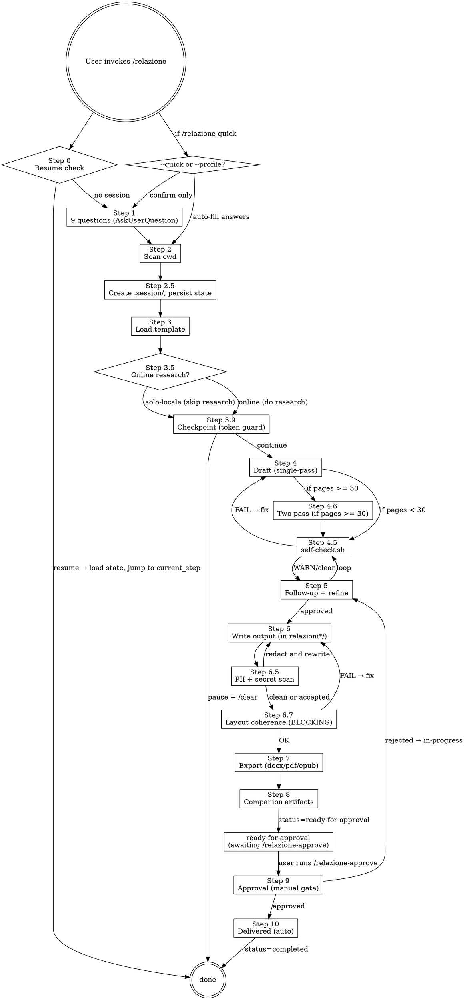

# Relazione (Report Writer)

Versione corrente: vedi `VERSION` — note di rilascio in `CHANGELOG.md`.

## Overview

Skill modulare per generare relazioni formali in Italiano/Inglese a partire dai file della cwd. Architettura a strati:

- `SKILL.md` — orchestratore (questo file)
- `steps/` — istruzioni dettagliate per ogni step (caricati on-demand via Read)
- `templates.md` — strutture per ogni tipologia
- `scripts/` — automazioni eseguibili (self-check, redact, mining, export, ecc.)
- `presets/` — risposte preconfigurate per pattern ricorrenti
- `pdf-templates/` — YAML pandoc/Eisvogel preset
- `schemas/session-state.schema.json` — schema validazione state
- `VERSION` — semver corrente skill

**Core principle:** la relazione DEVE leggersi come scritta dall'utente. Mai riferimenti a Claude, Anthropic, AI, "generato da intelligenza artificiale", disclaimers, o `Co-Authored-By: Claude`. Il testo è dell'utente. Assoluto. Vedi `steps/forbidden-terms.md` per la lista completa.

## When to Use

- Comandi: `/relazione`, `/relazione-quick`, `/relazione-continua`, `/relazione-rollback`, `/relazione-stats`, `/relazione-diff`, `/relazione-doctor`, `/relazione-setup`, `/relazione-estimate`
- Richieste in linguaggio naturale: "scrivimi una relazione", "fammi la relazione su…", "prepara un report di…", "write a report about…"
- Documentare progetto, esperienza, tesi, ricerca, lab, stage, codebase, bug, incidente

**NON usare per:** summary informali, chat replies, commit message, PR description, README (a meno che l'utente non chieda esplicitamente "relazione in formato README").

## Tool registry

| Categoria | Tool | Path | Quando usarlo |
|---|---|---|---|
| **Quality check** | `self-check.sh` | `scripts/quality/self-check.sh` | Step 4.5 e 6 — orchestratore |
| | `forbidden-check.sh` | `scripts/quality/forbidden-check.sh` | grep AI tells + auto-ref |
| | `readability.py` | `scripts/quality/readability.py` | Gulpease/Flesch per sezione |
| | `tone-drift.py` | `scripts/quality/tone-drift.py` | drift di registro |
| | `citation-density.py` | `scripts/quality/citation-density.py` | densità citazioni |
| | `voice-lock.py` | `scripts/quality/voice-lock.py` | lock voice profile per consistency |
| **Privacy** | `pii-redact.py` | `scripts/security/pii-redact.py` | Step 6.5 — email/IP/path/CF |
| | `secret-scan.sh` | `scripts/security/secret-scan.sh` | Step 6.5 — token/key/password |
| **Content intel** | `git-history-miner.sh` | `scripts/intel/git-history-miner.sh` | cronologia attività da git |
| | `zotero-import.py` | `scripts/intel/zotero-import.py` | bib da Zotero/Mendeley |
| | `schema-to-diagram.py` | `scripts/intel/schema-to-diagram.py` | ER diagram da Prisma/SQL |
| | `glossary-extract.py` | `scripts/intel/glossary-extract.py` | glossario auto da codice |
| **Output extra** | `executive-summary.py` | `scripts/export/executive-summary.py` | Step 8 — 1-pagina sintesi |
| | `slide-deck.py` | `scripts/export/slide-deck.py` | Step 8 — Marp/Beamer |
| | `bundle.sh` | `scripts/export/bundle.sh` | Step 8 — zip finale |
| | `defense-pack.py` | `scripts/export/defense-pack.py` | Step 8 — solo tesi |
| **Knowledge** | `knowledge-graph.py` | `scripts/intel/knowledge-graph.py` | Step 2.6 — build KG / from-scan / query |
| **Layout** | `layout-coherence.py` | `scripts/quality/layout-coherence.py` | Step 6.7 — verifica ordinamento blocchi (BLOCCANTE) |
| **Approval** | `audit-trail.py` | `scripts/workflow/audit-trail.py` | Step 9 — append-only audit log |
| | `watermark-pdf.py` | `scripts/export/watermark-pdf.py` | Step 9 — togli/aggiungi DRAFT/IN-REVIEW |

## Flow



## Step 0 — Auto-resume check (SEMPRE all'avvio)

Prima di qualsiasi domanda:

```
Glob: relazioni*/.session/session-state.json
Glob: relazioni*/
```

Classifica: **In-progress** (`status=in-progress` o `ready-for-approval`), **Completed/Approved**, **Orphan** (cartella senza `.session/`).

| Situazione | Comportamento |
|---|---|
| 0 cartelle | Procedi a Step 1 (nuova sessione) |
| 1 in-progress | `AskUserQuestion` (Riprendi / Nuova / Abbandona) |
| ≥ 2 cartelle | Menu di selezione (vedi `steps/step-0-resume.md`) |
| 1 completed, 0 in-progress | `AskUserQuestion` (Nuova / Apri esistente) |

**Su sessione esistente caricata:** valida state contro schema, mostra menu di ripresa guidato (Riprendi / Apri-e-decidi-insieme / Dashboard / Cambia risposta Step 1 / Salta a step). Dettagli completi in `steps/step-0-resume.md`.

**Slash commands correlati:** `/relazione-continua` (resume esplicito), `/relazione-rollback` (ripristino backup), `/relazione-stats` (dashboard), `/relazione-approve` (Step 9), `/relazione-doctor` (diagnostica), `/relazione-setup` (wizard primo uso).

## Quick mode

Se invocato come `/relazione-quick` o con `--profile=<nome>`: carica preset, auto-detect tipologia da nome cartella, compila `answers` con default, una sola `AskUserQuestion` di conferma. Dettagli in `steps/step-0-resume.md` § Quick mode e `steps/profiles.md`.

## Step 1 — Initial Questions

**USA SEMPRE `AskUserQuestion`**, mai testo libero. **10–11 domande in 4–5 batch** (Batch 5 condizionale a presenza di codice nella cwd).

Mappa sintetica delle domande:

| # | Domanda | Salva in `answers.` |
|---|---|---|
| 1 | Tipologia (12 opzioni) | `tipologia` |
| 2 | Lingua (it/en) | `lingua` |
| 3 | Stile registro | `stile` |
| 4 | Destinatario | `destinatario` |
| 5 | Lunghezza (4 fasce + Other) | `pages` |
| 6 | Elementi visivi (multi) | `visivi` |
| 7 | Formato (md/latex/both) | `formato` |
| 8 | Mock data (sì/no) | `mock` |
| 9 | Ricerca online (online/locale) | `ricerca_online` |
| 10 | Scan mode (rapido/profondo) — solo se >15 file | `scan_mode` |
| 11 | Code snippet — solo se `cwd_has_source_code` | `code_snippets` |

**Vedi `steps/step-1-questions.md`** per: opzioni complete di ciascuna domanda, default per tipologia, pre-flight code detection, regole mock, regole online, follow-up LaTeX (classe doc + bib).

**Salva tutte le risposte in `answers` di session-state.json.**

## Step 2 — Scan the Current Directory

Due modalità in base a `answers.scan_mode`:

### Step 2 `rapido` (default, single-pass nel main orchestrator)

- Usa Glob/Grep/Read (mai `find`/`cat`)
- **Escludi sempre:** `node_modules`, `.git`, `dist`, `build`, `.next`, `out`, `.cache`, `coverage`, `__pycache__`, `venv`, `.venv`, `target`, binary, lock files
- **Includi:** sorgenti, docs (`.md`/`.txt`/`.pdf`), config, `package.json`/`pyproject.toml`/etc., schemi (`.prisma`/`.sql`), README, immagini se domanda 6 lo richiede, `.tex`/`.cls`/`.sty`/`.bib` se latex
- Per codebase grandi: leggi README/package.json prima, poi sample mirato per tipologia
- Cwd vuota o irrilevante → avvisa utente, chiedi materiale

### Step 2 `profondo-parallelo` (4 subagent + hybrid store)

**Vedi `steps/step-2-parallel.md` per workflow completo.**

Highlights:
- 4 subagent paralleli (narrative/entities/temporal/assets) estraggono facet-specific
- Merge conservativo in `entities.jsonl` con provenance preservation
- Build `index/` (by-facet/file/section/date) + `graph.json`
- Round-trip check bloccante via `scripts/workflow/scan-rebuild-check.sh`
- Output: hybrid store in `.session/scan/` invece di raw content in main context
- Guadagno: −50-70% pressione main context, +15-20% precisione fattuale, ~90% meno allucinazioni su date/email. Vedi `docs/SKILL-GUIDE.md` per numeri completi.

**Fallback automatico a `rapido`** se:
- Sotto 15 file scansionabili
- Subagent crash 3x consecutivi
- Round-trip check FAIL dopo 2 tentativi di re-merge

## Step 2.5 — Persistenza state (OBBLIGATORIO)

Crea cartella di output (regole sotto in Step 6) con sottocartella `.session/`:

```
relazioni[-YYYY-MM-DD]/
├── .session/
│   ├── session-state.json       # validato contro schemas/session-state.schema.json
│   ├── scan-summary.md          # tabella file scansionati
│   ├── codebase-notes.md        # stack/moduli/fornitori/schema dati
│   ├── research-notes.md        # output Step 3.5 (o nota "ricerca disabilitata")
│   └── backups/                 # vedi steps/backup-and-versioning.md
├── RELAZIONE.md                 # output (scritto Step 6)
├── RELAZIONE.tex                # se formato include latex
└── references.bib               # se biblatex/bibtex
```

Inizializza `session-state.json` con:
- `status: "in-progress"`
- `skill_version`: leggi da `<skill_dir>/VERSION`
- `created_at`, `last_updated_at`
- `current_step: "step-2.5-persist"`
- `answers: {...}` da Step 1
- `output_folder`, `cover: {}`, `files_written: []`, `deps_installed: {}`
- `backups: []`, `mock_inventory: []`, `voice_profile: null`, `self_check_results: null`
- `token_budget: { estimated_tokens: <stima>, ... }` — vedi `steps/token-budget-guard.md`

**Aggiorna `last_updated_at` e `current_step` dopo OGNI step completato.** Validate prima di save.

### Step 2.6 — Build knowledge graph (SEMPRE, leggero)

Subito dopo Step 2.5, costruisci il knowledge graph vettorizzato — produce `.session/knowledge/` (50–200 KB tipici, hash-projection 128-dim). Vedi `steps/knowledge-graph.md`.

```bash
# Se Step 2 era 'rapido':
python3 scripts/intel/knowledge-graph.py build --root <cwd> --out <output>/.session/knowledge

# Se Step 2 era 'profondo-parallelo' (riusa entities.jsonl + graph.json):
python3 scripts/intel/knowledge-graph.py from-scan --scan <output>/.session/scan --out <output>/.session/knowledge
```

Aggiorna `session-state.json`: `knowledge_graph_ref`, `knowledge_graph_built_at`, `knowledge_graph_nodes`.

**Da Step 4 in poi, mai re-read di file sorgente** se il dato è recuperabile dal KG (`query.py "<text>" K`). Solo quando il KG punta a un file e serve testo verbatim, leggi quel singolo file (cache locale Step). Mai citare contenuto non attestato in `nodes.jsonl` o WebSearch.

## Step 3 — Load Template

Read `templates.md`, sezione corrispondente alla tipologia scelta. Definisce: sezioni obbligatorie, sezioni suggerite, registro, follow-up questions specifiche.

## Step 3.5 — Online Research

**Vedi `steps/step-3.5-research.md` per regole complete.**

Gate: se `answers.ricerca_online == "solo-locale"`, scrivi nota in `research-notes.md` e SALTA. Mai WebSearch/WebFetch in tutta la sessione.

Se `online`: WebSearch + WebFetch per stato arte, algoritmi, librerie, standard, bibliografia. Output strutturato in `research-notes.md` (URL, autori, anno, venue, estratto).

**Regola assoluta:** mai inventare URL/DOI/autori/titoli. Cita solo fonti effettivamente recuperate.

## Step 3.6 — Outline-first review (opzionale, attivo per pages >= 30)

**Vedi `steps/step-3.6-outline.md`.**

Genera prima la struttura (indice + 1 frase per sezione, ~2.5k token), la sottoponi all'utente per approvazione/modifica, poi Step 4 espande sezione per sezione partendo dall'outline approvato.

Trigger:
- `pages >= 30` → proponi attivazione
- `pages >= 60` → attiva di default (utente può rifiutare)
- `--outline-first` flag → forza
- `tipologia == "custom"` → sempre raccomandato

Vantaggi: -30% token output draft, -40% iterazioni Step 5, l'utente co-crea invece di ricevere.

Salva in `session-state.json.outline.{approved, version, path, section_count}`.

## Step 3.9 — Checkpoint pre-draft (token budget guard)

**Vedi `steps/token-budget-guard.md`.**

Stima token consumo per draft + refinement (formula: `5000 + pages*600 + (online ? min(pages*200, 15000) : 0) + (mock ? pages*100 : 0) + pages*300`).

Salva in `session-state.json.token_budget.estimated_tokens`.

`AskUserQuestion`:
- `Continua ora` (se < 60k) → Step 4
- `Two-pass + checkpoint dopo Pass 1` (raccomandato se >= 60k) → Step 4.6
- `Pausa e /clear` → istruisci utente a fare `/clear` poi `/relazione` (auto-resume)
- `Mostra riassunto analisi` → mostra `scan-summary.md` + `codebase-notes.md`, richiedi

Se `Pausa`: salva state con `current_step: "step-4-ready"`, stampa istruzioni resume, termina.

## Step 4 — Generate Draft

**Pre-step:** crea backup pre-draft in `.session/backups/{ISO}-pre-draft/` (vedi `steps/backup-and-versioning.md`).

Modalità single-pass (default per pages < 30) o two-pass (per pages >= 30, vedi `steps/step-4.6-two-pass-writing.md`).

**Length scaling:**
- Short (5-15): solo essenziali, paragrafi compatti
- Medium (15-40): tutte le sezioni, esempi, tabelle, 1-2 pagine bibliografia
- Long (40-80): sottosezioni, motivazioni dietro ogni scelta, alternative scartate, 3-5 pp bibliografia, appendici
- Very long (80+): narrativa estesa fornitori/tool/librerie, codice riga-per-riga, sezioni dedicate a difficoltà/testing/performance/sicurezza, appendici complete

Heuristic: ~400 parole per pagina A4.

**Mock handling:**
- `sì-mock`: riempi con dati realistici, marca prima occorrenza con `[MOCK]` (md) o `\textcolor{orange}{[MOCK]}` / commento `% MOCK` (tex). Append a `mock_inventory[]` in state.
- `no-placeholder`: `[DA COMPLETARE: <cosa>]` ovunque, mai mockare.

**Code snippet handling:** vedi `steps/code-snippets.md` per regole complete in base ad `answers.code_snippets` (`no` / `sì-mirato` / `sì-estensivo` / `solo-appendice`) e regole comuni (path di provenienza, mai inventare, masking secret, language hint).

**Voice profile lock** (per long/very long): dopo prima sezione del draft, esegui:
```bash
python3 scripts/quality/voice-lock.py extract <file> --state <state>
```
Le sezioni successive devono mantenere voice profile (verifica in Step 4.5).

**Non gonfiare per raggiungere target.** Se materiale insufficiente, chiedi all'utente, non inventare.

## Step 4.5 — Self-check pre-output

**Vedi `steps/step-4.5-self-check.md` per dettaglio.**

Esegui:
```bash
bash scripts/quality/self-check.sh <file> --lang=<it|en> --state=<state> --target-pages=<N>
```

Orchestratore che lancia: word count, forbidden terms, AI tells, citation density, image references, citation keys, mock inventory consistency, readability (Gulpease/Flesch), tone-drift, voice-lock verify.

Output: report con `[OK]`/`[WARN]`/`[FAIL]`. Salva in `session-state.json.self_check_results`.

- **FAIL > 0** → blocca write, mostra lista, chiedi rewrite, ri-esegui
- **WARN > 0** → mostra, chiedi conferma "procedo o rivedo?"
- **Clean** → procedi a Step 5 o 6

## Step 5 — Follow-up + Refine

Mostra draft. Chiedi domande tipologia-specifiche (da `templates.md`) in batch di 3-5.

Per target lungo: domande approfondite su esperienze personali, dati, numeri, nomi fornitori/colleghi/prodotti, difficoltà.

Se domanda 6 includeva grafici dati ma non forniti, chiedi dati (CSV/JSON) o paths immagini. Se `sì-mock`, usa mock marcati.

Se latex senza template/bib, chiedi ora.

Quando l'utente fornisce dati reali, sostituisci `[MOCK]` corrispondenti e aggiorna `mock_inventory`.

**Integrazioni potenti** (proponi quando rilevante):
- `git-history-miner.sh` per `stage`/`finale`/`progetto`: estrae cronologia da git
- `zotero-import.py` se trovi `*.bib`/`Zotero.json`/`*.ris` nella cwd
- `schema-to-diagram.py` se trovi `schema.prisma` o SQL DDL → ER diagram
- `glossary-extract.py` per `analisi-codice` o tesi tecnica → glossario auto

Backup pre-refine in `.session/backups/{ISO}-pre-refine-{N}/`.

Loop: Step 5 → Step 4.5 → Step 5 finché clean / utente OK.

## Step 6 — Write Final Output

**Cartella di output (REGOLE FERME):**
1. Default: `relazioni/` in cwd
2. Se esiste: `relazioni-YYYY-MM-DD`
3. Se anche quella: `relazioni-YYYY-MM-DD-2`, `-3`, ...
4. **Verifica con Glob/ls PRIMA di creare** — mai assumere
5. `mkdir -p` poi comunica all'utente nome cartella scelto

**File finali (in base a `formato`):**
- `md`: `RELAZIONE.md` (default naming, vedi Quick Reference per altri)
- `latex`: `RELAZIONE.tex` + `references.bib` (se bib)
- `both`: entrambi

**Regole comuni:**
- Path completo: `<cwd>/relazioni[...]/RELAZIONE.md` — mai direttamente in cwd
- Immagini cwd da includere: copia in `<output>/img/` e aggiorna path
- Cover: titolo, autore (chiedi mai inventare anche con sì-mock), data, destinatario
- TOC se >=15 pagine
- `\listoffigures`/`\listoftables` se latex con figure/tabelle numerate
- **Se mock usati:** sezione "Nota metodologica" prima della bibliografia, lista tutti i `[MOCK]`

## Step 6.5 — PII + Secret check

**Vedi `steps/step-6.5-pii-secret-check.md`.**

Default attivo per: `analisi-codice`, `bug`, `codice` o se utente passa `--public`.

```bash
python3 scripts/security/pii-redact.py <file> --mode=warn
bash scripts/security/secret-scan.sh <file>
```

- Secret trovato → BLOCCANTE. Chiedi rimozione/sostituzione con placeholder. Re-run.
- PII trovato → `AskUserQuestion`: redact tutti / interactive review / accetta come internal.

Per modalità `--public`: applica `--mode=redact` direttamente.

## Step 6.7 — Layout coherence check (BLOCCANTE)

**Vedi `steps/step-6.7-layout-coherence.md`.**

```bash
python3 scripts/quality/layout-coherence.py <output>/RELAZIONE.md \
  --style=<accademico|moderno|brand> \
  --tipologia=<tipologia>
```

Per `formato ∈ {latex, both}` esegui anche su `RELAZIONE.tex`. Devono passare ENTRAMBI.

- **FAIL > 0** → BLOCCA. `AskUserQuestion`: `Riordina automaticamente` / `Correggi manualmente (pausa)` / `Forza export (sconsigliato, blocca approvazione)`.
- **WARN > 0** → mostra, chiedi conferma `procedo / rivedo`.
- **OK** → procedi a Step 7.

Salva risultato in `session-state.json.layout_check`. Se `force_overridden: true`, lo step 9 (approve) viene BLOCCATO.

## Step 7 — Export (DUAL-STYLE, DOCX SEMPRE)

**Vedi `steps/step-7-export.md` per workflow completo.**

### Regola ferma — output minimo garantito

| Output | Quando |
|---|---|
| `RELAZIONE.docx` | **SEMPRE** (no eccezioni) |
| `RELAZIONE.pdf` (Stile B = moderno) | **SEMPRE** |
| `RELAZIONE.tex` + `RELAZIONE-tex.pdf` (Stile A = accademico) | Se `formato ∈ {latex, both}` |

Quando `formato` include LaTeX, si producono **2 stili grafici visivamente distinti**:
- **Stile A — Accademico**: `RELAZIONE.tex` + `RELAZIONE-tex.pdf` (BibLaTeX, classe `article/report/book`, sobrio)
- **Stile B — Moderno**: `RELAZIONE.docx` + `RELAZIONE.pdf` (eisvogel colorato, mirror reciproco — stesso layout, stessa palette)

DOCX e PDF moderno DEVONO rispecchiarsi (stesso `pdf_style`, stesso TOC, stessa cover).

### Highlights

- **Step 7.0** — Scelta preset Stile B (`moderno` default | `brand` se attivo). Lo Stile A è sempre accademico.
- DOCX prodotto via `pandoc → reference-doc` per uniformità con il PDF moderno.
- Quando `formato == "latex"`: pandoc `tex → md` come sorgente intermedia per generare DOCX + modern PDF.
- Naming: PDF da LaTeX si chiama SEMPRE `RELAZIONE-tex.pdf` (anche senza collisione, per chiarezza).
- Verifica dipendenze (pandoc/xelatex/biber/mermaid-filter/pygmentize) PRIMA di compilare.
- Diff visivo bloccante: hash thumbnail prima pagina di `RELAZIONE.pdf` vs `RELAZIONE-tex.pdf` deve essere DIVERSO.
- Tool mancanti → `AskUserQuestion`: install ora / alternative online / skip.
- Eisvogel template setup: `steps/eisvogel-setup.md`.
- **Mai claimare successo se compilazione fallisce.** Mostra log esatto.

EPUB se richiesto: `pandoc <file>.md -o <file>.epub --toc --metadata title=... author=...`

## Step 8 — Companion artifacts

**Vedi `steps/step-8-companion-artifacts.md`.**

`AskUserQuestion` multi-select:
- `Executive summary` → `python3 scripts/export/executive-summary.py`
- `Slide deck` → `python3 scripts/export/slide-deck.py --engine={marp|beamer}`
- `EPUB` → comando pandoc
- `Bundle .zip` → `bash scripts/export/bundle.sh <output_folder>`
- `Defense pack` (solo `tesi`) → `python3 scripts/export/defense-pack.py`

I preset hanno `post_actions` che pre-selezionano companion da generare automaticamente.

Per ogni companion generato, append a `session-state.json.files_written`.

**Step finale Step 8:** setta `status: "ready-for-approval"` in state. **NON più `completed`.** Solo Step 9 (via `/relazione-approve`) può promuovere ad `approved`, e solo dopo Step 10 si arriva a `completed`.

## Step 9 — Approval (richiede `/relazione-approve` ESPLICITO)

**Vedi `steps/step-9-approval.md`.**

State machine canonica: `in-progress → ready-for-approval → approved → completed`.

Lo Step 8 lascia la sessione in `ready-for-approval`. Per finalizzare:

1. Utente lancia `/relazione-approve`
2. Pre-check: `status` deve essere `ready-for-approval`, `layout_check.force_overridden` deve essere `false`, `self_check_results` senza FAIL residui
3. `AskUserQuestion`: `Approva e finalizza` / `Approva con riserva` / `Rifiuta (rejected)` / `Annulla`
4. Su approva: aggiorna `cover.status: approved`, `cover.versione: 1.0` (default), append `audit-trail.jsonl`, watermark off, copia in `<output>/archive/v<versione>/`, `status: "approved"`
5. **Step 10 — Delivered (auto)**: integrity hash, optional GPG sign, finalizza companion, `status: "completed"`, `completed_at`

Su `Rifiuta`: `status` torna a `in-progress`, `current_step: "step-5-followup"`, scrivi `feedback-import.md` con motivazione.

**Transizioni proibite (BLOCCATE):**
- `in-progress → completed` (manca approval)
- `in-progress → approved` (manca approval)
- `ready-for-approval → completed` (manca approve)
- modifiche manuali a `session-state.json.status` saltando passaggi

L'audit trail è append-only: dopo `approved` non si modifica.

## NON-NEGOTIABLE RULES

**1. Forbidden output (mai):** vedi `steps/forbidden-terms.md` — Claude/Anthropic/AI-refs/Co-Authored-By/AI tells stilistici. Auto-check con `scripts/quality/forbidden-check.sh`.

**2. Mai inventare:** nomi persone, bibliografia, URL/DOI, dati fiscali, citazioni — sempre placeholder o fonte verificata. **Mai citare contenuto non attestato nel knowledge graph (`nodes.jsonl`) o in WebSearch.**

**3. Rispetta `solo-locale`:** se utente sceglie, ZERO WebSearch/WebFetch in tutta la sessione.

**4. Output sempre in sottocartella:** mai sparsi nella cwd.

**5. DOCX SEMPRE prodotto + 2 stili distinti quando applicabile:** `.docx` esce sempre. PDF moderno (Stile B) sempre. Se `formato ∈ {latex, both}`, ANCHE LaTeX-PDF accademico (Stile A). I 2 stili devono essere visivamente distinguibili (verifica diff thumbnail). Naming differenziato (`RELAZIONE-tex.pdf`).

**6. Secret in code → BLOCCANTE:** rimuovi prima di consegnare.

**7. State sempre aggiornato:** `last_updated_at` + `current_step` dopo ogni step. Validate JSON prima di save.

**8. Backup automatico** prima di ogni rigenerazione. Retention: ultimi 10.

**9. Layout coherence (Step 6.7) BLOCCANTE:** mai produrre PDF/DOCX se il layout-coherence check ha FAIL > 0. Force override è permesso solo con conferma esplicita ma blocca poi `/relazione-approve`.

**10. State machine STRETTA per approval:** la sessione NON può passare a `completed` senza il comando `/relazione-approve` esplicito. Step 8 termina in `ready-for-approval`, mai in `completed`. Le transizioni proibite (`in-progress → completed`, `ready-for-approval → completed` senza `approved` di mezzo) generano errore `INVALID_STATE_TRANSITION` e abortiscono il save.

**11. Knowledge graph SEMPRE costruito (Step 2.6):** `.session/knowledge/` è sorgente di verità per Step 4/5. Mai re-read di file sorgente se il dato è recuperabile via `query.py`. Solo file che il KG referenzia possono essere riletti per testo verbatim.

## Quick Reference

| Tipologia | Pages tipiche | File output md | File output tex | Registro | Formato consigliato | Preset |
|---|---|---|---|---|---|---|
| tecnica | 10-30 | RELAZIONE.md | RELAZIONE.tex | tecnico | md | example-brand-tecnica |
| laboratorio | 5-15 | RELAZIONE.md | RELAZIONE.tex | tecnico-scientifico | md | — |
| stage | 20-40 | RELAZIONE.md | RELAZIONE.tex | formale | md | — |
| progetto | 30-100+ | RELAZIONE.md | RELAZIONE.tex | formale esteso | md | progetto-aziendale |
| codice | 5-30 | DOC.md | DOC.tex | tecnico | md | — |
| analisi-codice | 10-40 | ANALISI.md | ANALISI.tex | tecnico-critico | md | — |
| bug | 2-10 | POSTMORTEM.md | POSTMORTEM.tex | fattuale | md | bug-postmortem-rapido |
| finale | 10-30 | RELAZIONE-FINALE.md | RELAZIONE-FINALE.tex | riepilogativo | md | — |
| **tesi** | 40-150 | TESI.md | TESI.tex | accademico rigoroso | **latex** | tesi-magistrale |
| **ricerca** | 15-40 | PAPER.md | PAPER.tex | accademico | **latex** | paper-ricerca-italiano |
| esperienza | 5-20 | ESPERIENZA.md | ESPERIENZA.tex | narrativo-strutturato | md | — |
| custom | (chiedi) | (chiedi) | (chiedi) | (chiedi) | (chiedi) | — |

## Sub-agent delegation policy

Ogni invocazione di Task/subagent costa ~20k token di startup. Delega **solo** quando:

- L'output sarebbe troppo verboso per il main context (>5k token di lint/scan/diff)
- 4+ esportazioni indipendenti possono parallelizzarsi (PDF + DOCX + EPUB + LaTeX)
- È un'attività di scan deep (`step-2-parallel.md` — 4 facet-specific agent)

**Non delegare** lookup brevi (single Read), risoluzione variabili, stato session, classificazione single-fact. Vedi `docs/PERFORMANCE.md` per linee guida quantitative.

## Red Flags — vedi `steps/red-flags.md`

Lista completa di anti-pattern e regole bloccanti caricabile on-demand. Le regole più critiche sono già in §NON-NEGOTIABLE RULES sopra.

## Slash commands ecosystem

| Comando | File | Funzione |
|---|---|---|
| `/relazione` | (questa skill) | Flusso completo |
| `/relazione-quick` | `~/.claude/commands/relazione-quick.md` | Skip questions, default smart o preset |
| `/relazione-continua` | `~/.claude/commands/relazione-continua.md` | Resume — apre menu guidato (default: riprendi; opzione libera "leggi e decidi insieme") |
| `/relazione-rollback` | `~/.claude/commands/relazione-rollback.md` | Ripristino backup |
| `/relazione-stats` | `~/.claude/commands/relazione-stats.md` | Dashboard sessioni + diagnostica |
| `/relazione-diff` | `~/.claude/commands/relazione-diff.md` | Diff tra due iterazioni |
| `/relazione-approve` | `~/.claude/commands/relazione-approve.md` | **Step 9** — promuove ready-for-approval → approved → completed |
| `/relazione-import-feedback` | `~/.claude/commands/relazione-import-feedback.md` | Importa feedback (es. da reject) e torna in-progress |

## Templates

Strutture dettagliate per tipologia in `templates.md`. Read on-demand quando tipologia è scelta. Strutture neutre rispetto al formato: `#` markdown ↔ `\section{}` LaTeX.
