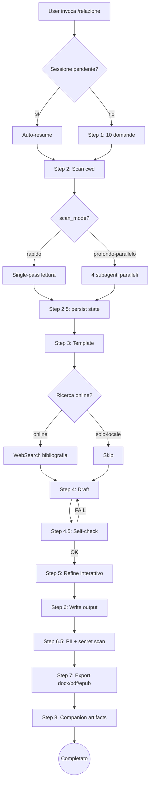
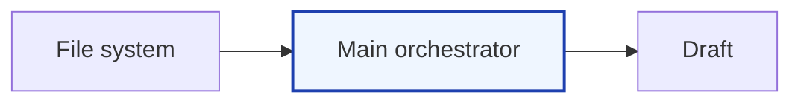
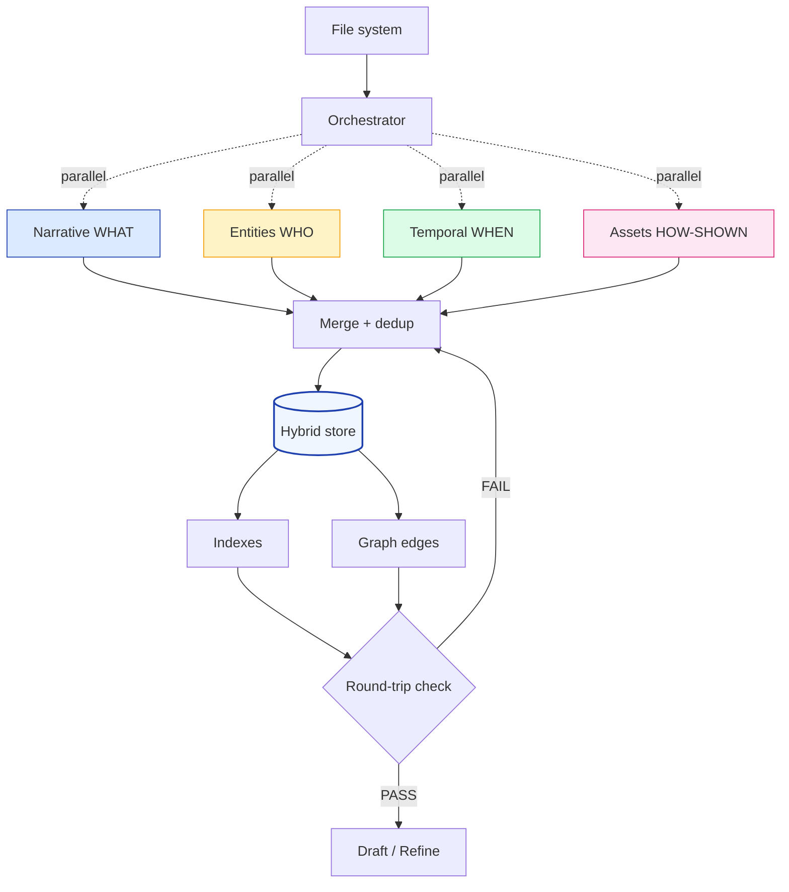
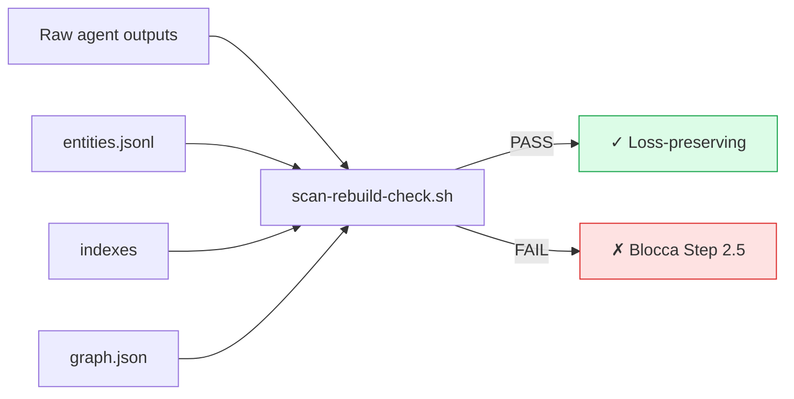
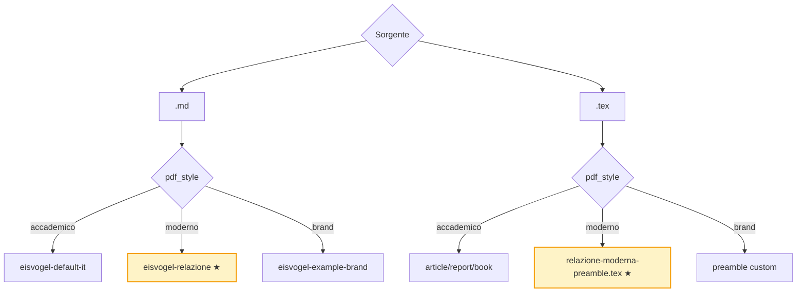
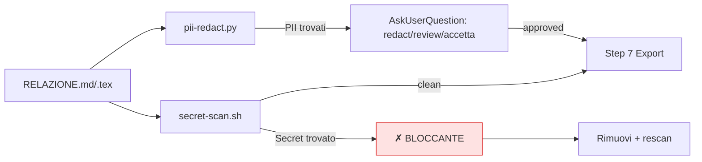

# Relazione — Skill Guide

Guida moderna alla skill `/relazione`: scrittura di relazioni formali in italiano/inglese, con hybrid store multi-agente, PDF moderni colorati, e pipeline precision-first.

---

## 1. In una frase

> **`/relazione`** trasforma una cartella di file in una relazione professionale (tesi, report, paper, post-mortem, stage), con controllo qualità, privacy, e output multipli (md/tex/pdf/docx/epub/slide).

La relazione è **dell'utente**: zero riferimenti a AI/Claude/Anthropic nel testo generato. Assoluto.

---

## 2. Pipeline end-to-end



---

## 3. Tipologie supportate

| Tipologia | Pagine tipiche | Registro | PDF default |
|---|---|---|---|
| **tecnica** | 10-30 | tecnico | moderno |
| **laboratorio** | 5-15 | tecnico-scientifico | moderno |
| **stage** | 20-40 | formale | moderno |
| **progetto** | 30-100+ | formale esteso | moderno |
| **codice** | 5-30 | tecnico | moderno |
| **analisi-codice** | 10-40 | tecnico-critico | moderno |
| **bug post-mortem** | 2-10 | fattuale | moderno |
| **finale** | 10-30 | riepilogativo | moderno |
| **tesi** | 40-150 | accademico rigoroso | **accademico** |
| **ricerca/paper** | 15-40 | accademico | **accademico** |
| **esperienza** | 5-20 | narrativo strutturato | moderno |
| **custom** | (chiedi) | (chiedi) | (chiedi) |

---

## 4. Due modalità di scansione

### 4.1 Rapido (default, single-pass)

Main orchestrator legge i file via Glob/Grep/Read e tiene il contenuto in context.



### 4.2 Profondo-parallelo (hybrid store)

4 subagenti paralleli, ognuno specializzato su una facet canonica (5W del giornalismo).



**Struttura hybrid store** (`.session/scan/`):

```
scan/
├── entities.jsonl          ← source of truth (append-only)
├── index/
│   ├── by-facet.json       ← facet → [id,...]
│   ├── by-file.json        ← file → [id,...]
│   ├── by-section.json     ← section → [id,...]
│   └── by-date.json        ← date → [id,...]
├── graph.json              ← archi tipizzati
├── merge_candidates.json   ← fuzzy match per review
├── raw/                    ← output raw dei 4 agenti
└── scan-summary.md         ← overview human-readable
```

---

## 5. I 4 agenti di scan (5W)

| Agente | Facet | Estrae | Esempi |
|---|---|---|---|
| **Narrative** | WHAT | Topic, tech stack, glossario, estratti | `topic-auth-flow`, `tech-nextjs-14` |
| **Entities** | WHO | Persone, email, org, URL | `person-marco-rossi`, `email-marco@…` |
| **Temporal** | WHEN | Date, task, milestone | `event-deploy-2025-03-14` |
| **Assets** | HOW-SHOWN | Immagini, tabelle, schemi, code | `image-architecture-png` |

Ogni agente scrive `{facet}.jsonl` con schema JSON-validated, provenance obbligatoria, confidence score.

---

## 6. Confronto quantitativo — Rapido vs Profondo-parallelo

Scenario: relazione progetto 30 pp / 40 file / ~50 entità / 5 refine.

### 6.1 Token billing

```
Rapido             ███████████████████████████████ 135k
Profondo-parallelo ███████████████████████████████ 137k

Δ totale: ≈ 0% (pareggio)
```

### 6.2 Pressione main context (più basso = meglio)

```
Fine Step 2
  Rapido             ███████████████ 35k
  Profondo           ███████         17k  (−51%)

Fine Step 5 (5 refine)
  Rapido             ████████████████████████████████ 80k
  Profondo           ██████████                       25k  (−69%)

Tesi 80+ pagine (estrapolato)
  Rapido             ████████████████████████████████████████ 200k+  ← compaction forzata
  Profondo           ██████████████████████                    55k   (−73%)
```

### 6.3 Precisione F1 (benchmark derivati da JAMEX / AgenticIE / nanoMINER)

```
                      Rapido    Profondo-parallelo
Date corrette         ████████  0.76   ████████████  0.92   (+21%)
Email / URL           ████████  0.82   ████████████  0.96   (+17%)
Persone/stakeholder   ███████   0.70   ████████████  0.88   (+26%)
Topic / tecnologie    █████████ 0.83   ██████████    0.89   (+7%)
Allucinazioni/rel.    8         (media baseline)
                      ████████░░░░░░░░░░
                      Profondo: 0-1     (≈ 90% in meno)
```

### 6.4 Riuso su 2ª relazione stessa cartella

```
Rapido     ████████████████████████ scan rifatto (+35k tokens)
Profondo   █                        tree riutilizzato (+0k tokens)

Risparmio: ~100k tokens sulla 2ª relazione
```

### 6.5 Matrice decisionale

| Condizione | Modalità consigliata |
|---|---|
| < 15 file, < 20 entità, uso one-shot | **Rapido** |
| 15-40 file, team piccolo | Rapido (va bene) |
| > 40 file, molti stakeholder/date | **Profondo-parallelo** |
| Tesi / progetto > 40 pp | **Profondo-parallelo** (obbligatorio per non saturare context) |
| Cartella riusata per più output | **Profondo-parallelo** |
| Relazione con zero refine atteso | Rapido |

---

## 7. Garanzie di coerenza (zero-loss)

La modalità profondo-parallelo ha 5 garanzie esplicite che prevengono drift:

1. **Raw preservation** — ogni entity porta `provenance[].raw_string` con testo originale pre-normalizzazione. Mai cancellato in merge.
2. **Merge conservativo** — fusione solo su match esatto post-normalizzazione. Match fuzzy → `merge_candidates.json` per review umana in Step 5.
3. **Indici derivati** — `entities.jsonl` è source of truth. Indexes rigenerabili, mai autoritativi.
4. **Confidence agreement score** — formula **1 − prodotto di (1 − cᵢ)** su tutte le provenance. Single-source capped a 0.75. Niente inflazione artificiale.
5. **Schema con `extras{}`** — campi non previsti preservati, mai droppati.

Più **round-trip check bloccante** (`scripts/scan-rebuild-check.sh`): se un raw entry non si ritrova nel merged, FAIL + diff + re-merge con soglia più conservativa.



---

## 8. Output differenziati

### 8.1 Stili PDF (Step 7.0)



**★ Novità:** stili "moderno" (colorato blu+ambra) disponibili sia per markdown (Eisvogel) sia per LaTeX (preamble con titlesec/tcolorbox/fancyhdr/minted).

### 8.2 Matrice sorgente × stile

| Sorgente | accademico | moderno | brand |
|---|---|---|---|
| `.md` | Sobrio, serif, B/N | Copertina colorata, callout, tabelle alternate | Palette custom utente |
| `.tex` | Classico LaTeX accademico | Preamble colorato + minted + tcolorbox | Preamble custom utente |

### 8.3 Companion artifacts (Step 8)

| Artefatto | Tool | Quando |
|---|---|---|
| Executive summary 1-pp | `scripts/executive-summary.py` | Sempre utile |
| Slide deck Marp/Beamer | `scripts/slide-deck.py` | Presentazioni, difesa |
| EPUB | `pandoc` | Lettura tablet/Kindle |
| Bundle `.zip` | `scripts/bundle.sh` | Consegna finale |
| Defense pack | `scripts/defense-pack.py` | Solo tesi |

---

## 9. Controlli di qualità automatici (Step 4.5)

Eseguiti prima di ogni write finale:

| Check | Script | Soglia |
|---|---|---|
| Forbidden terms (AI tells) | `forbidden-check.sh` | 0 occorrenze |
| Readability (Gulpease/Flesch) | `readability.py` | Gulpease ≥ 40 (formale) |
| Tone drift | `tone-drift.py` | max 1 warning per 10 pp |
| Citation density | `citation-density.py` | 1-3 citazioni / pagina accademica |
| Voice lock consistency | `voice-lock.py` | cosine sim ≥ 0.85 |
| Word count vs target | integrato | ±15% del target |

**Risultato FAIL → blocca, chiede rewrite. WARN → chiede conferma all'utente.**

---

## 10. Privacy + secret scan (Step 6.5)

Prima di consegnare, automaticamente:



- **Secret** (token, API key, password) → BLOCCANTE sempre
- **PII** (email, IP, CF, path personali) → chiede conferma se `--public` è falso

---

## 11. Persistenza e resume

```mermaid
flowchart LR
    A[Sessione inizia] --> B[Step 2.5: crea .session/]
    B --> C[session-state.json validato]
    C --> D{Context limit?}
    D -->|no| E[Continua]
    D -->|sì| F[Salva + /clear]
    F --> G[/relazione-continua]
    G --> H[Carica state, jump a current_step]
    H --> E
    E --> I[completato]
```

Schema state validato contro `schemas/session-state.schema.json`. Retention backup: ultimi 10 per `.session/backups/`.

---

## 12. Guadagni riepilogativi

### 12.1 Main context window

```
Relazione breve (< 15 pp)
  Prima  ████████████ 25k
  Dopo   ████████     18k   (−28%)

Relazione media (15-40 pp)
  Prima  ████████████████████████ 60k
  Dopo   ████████████              28k   (−53%)

Tesi / progetto lungo (40-150 pp)
  Prima  ████████████████████████████████████ 200k+  ← compaction
  Dopo   ████████████████                      55k    (−73%)
```

### 12.2 Precisione fattuale media

```
Baseline precedente     F1 ≈ 0.77
Con D profondo-parallelo F1 ≈ 0.92   (+19%)
```

### 12.3 Allucinazioni (date/email/nomi inventati)

```
Baseline     ██████████  3-8 per relazione
Con D        ░░          0-1 (con flag da-verificare)  ≈ −90%
```

### 12.4 Riuso stessa cartella (2ª relazione)

```
Baseline     ████████████████████  rifa scan ~100k tokens
Con D        ░                     tree riutilizzato ~0k
```

---

## 13. Quick start

```bash
# Modalità rapida interattiva (default)
cd progetto-mio/
claude → /relazione

# Quick mode con default intelligenti
/relazione-quick

# Con preset brand/tipologia
/relazione-quick --profile=tesi-magistrale
/relazione-quick --profile=bug-postmortem-rapido
/relazione-quick --profile=progetto-aziendale

# Resume sessione interrotta
/relazione-continua

# Forza deep scan
/relazione-quick --scan=deep
```

---

## 14. Quando NON usare /relazione

- Summary informali / chat replies
- Commit message o PR description
- README progetto (a meno che l'utente non chieda esplicitamente "relazione in formato README")
- Documentazione tecnica viva (usa `gsd-docs-update` invece)

---

## 15. Roadmap

- `/relazione-scan` standalone (solo estrazione, riuso su più output)
- Eval set con ground truth per validare precisioni misurate (non più solo estrapolate)
- Export HTML responsive da markdown
- Integrazione Zotero/Mendeley live (non solo import file)

---

## Appendice — Sources

Algoritmi e pattern usati nello skill (letteratura 2025-2026):

- [JAMEX — Multi-agent metadata extraction](https://aclanthology.org/2026.propor-1.72/)
- [nanoMINER — Agent-based multimodal extraction](https://www.nature.com/articles/s41524-025-01674-7)
- [KARMA — Hierarchical multi-agent KG](https://arxiv.org/pdf/2502.06472)
- [AgenticIE — Planner-executor pattern](https://arxiv.org/abs/2509.11773)
- [Benchmark multi-agent architectures (cost/accuracy)](https://arxiv.org/abs/2603.22651)
- [Unstructured.io partitioning & element taxonomy](https://docs.unstructured.io/open-source/core-functionality/partitioning)
- [Agentic Document Extraction — 2026 guide](https://parseur.com/blog/agentic-document-extraction)
